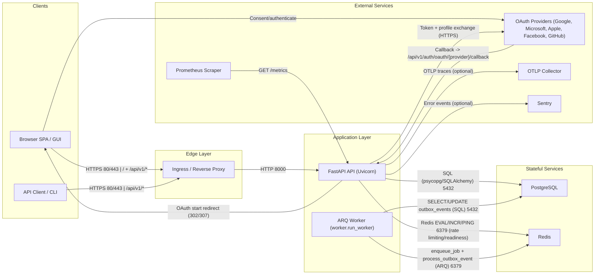
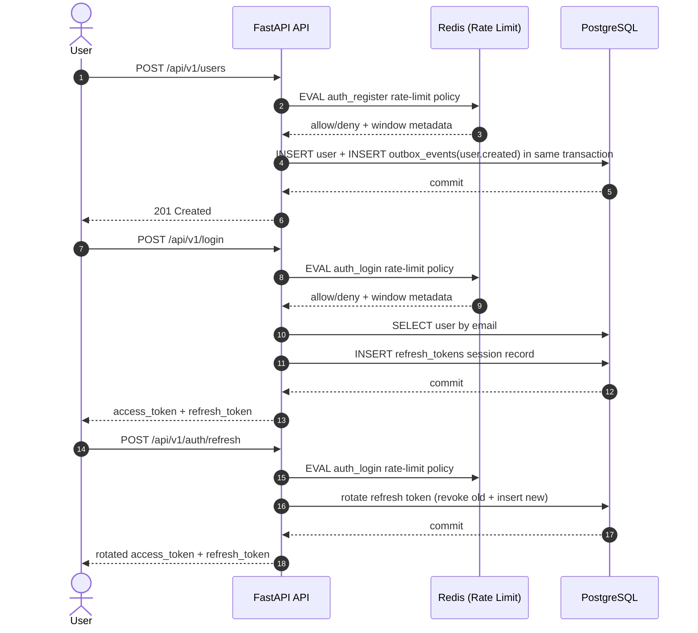
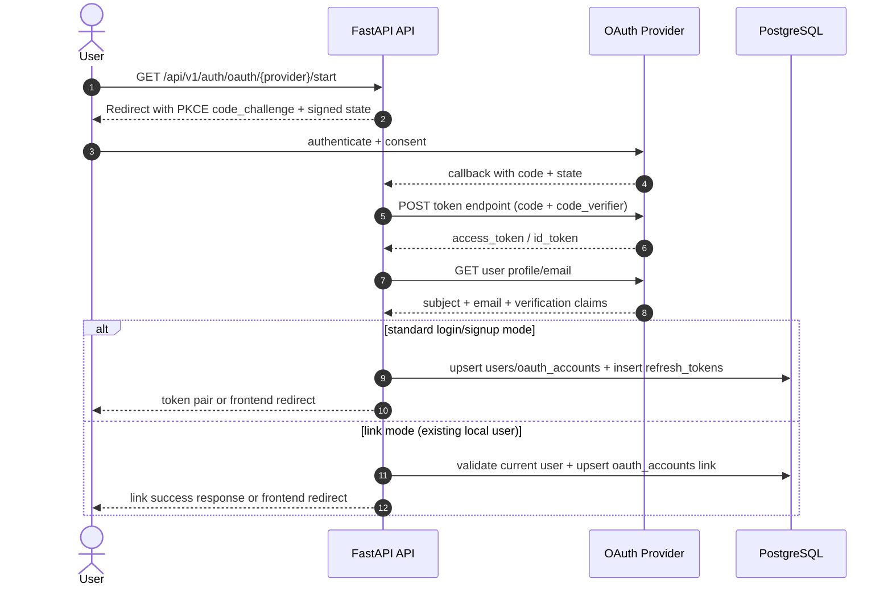
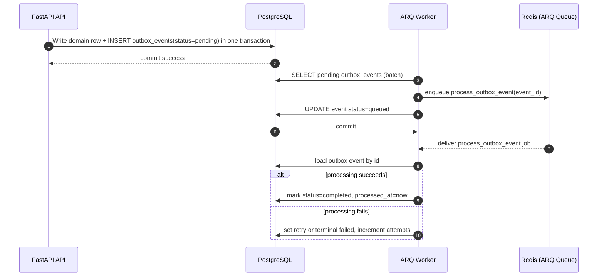
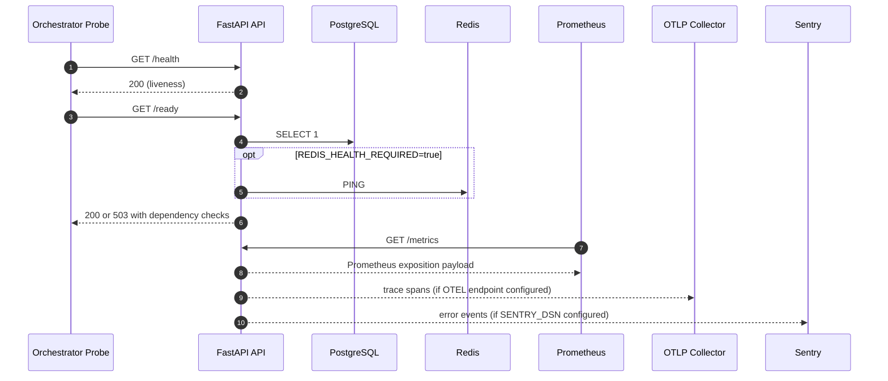

# Architecture Overview

## Purpose

This repository is a FastAPI-first full-stack starter template focused on:

- secure auth foundations (access + refresh lifecycle)
- production-oriented API behavior (versioning, error contracts, throttling)
- operational readiness (health/readiness, metrics, tracing, error reporting)
- extensibility for async/background workflows (outbox + worker scaffold)

## Infrastructure Communication Diagram

## Detailed Communication Flows

### 1) Register, Login, and Refresh

### 2) OAuth Login and OAuth Account Linking

### 3) Write Path and Async Outbox Worker Flow

### 4) Readiness, Metrics, Traces, and Error Signals

## Communication Matrix

| From | To | Protocol | Primary Purpose |
| --- | --- | --- | --- |
| Client | API | HTTPS | Versioned REST API calls (`/api/v1/*`) and frontend delivery |
| API | PostgreSQL | TCP 5432 (SQL via psycopg/SQLAlchemy) | Core persistence, auth sessions, OAuth links, outbox events |
| API | Redis | TCP 6379 (Redis commands + Lua) | Rate limiting counters, optional readiness check |
| API | OAuth providers | HTTPS | OAuth authorization code exchange and identity/profile fetch |
| Worker | PostgreSQL | TCP 5432 (SQL) | Outbox polling and completion/retry state updates |
| Worker | Redis | TCP 6379 (ARQ) | Job enqueue/dequeue and scheduler coordination |
| Prometheus | API | HTTP GET `/metrics` | Metrics scraping |
| API | OTLP collector | HTTP/gRPC (OTLP) | Trace export (optional) |
| API | Sentry | HTTPS | Error event export (optional) |

## Runtime Components

- API app: `app/main.py`
- Routers:
  - `app/routers/auth.py`
  - `app/routers/user.py`
  - `app/routers/post.py`
  - `app/routers/vote.py`
  - `app/domains/*/router.py` (auto-discovered domain routers)
- Auth/JWT services: `app/oauth2.py`
- OAuth provider orchestration: `app/oauth_external.py`
- Error contracts (RFC 7807): `app/errors.py`
- Rate limiting: `app/rate_limit.py` + `app/redis_client.py`
- Health/readiness checks: `app/health.py`
- Observability hooks: `app/observability.py`
- Outbox helpers: `app/outbox.py`
- ORM models: `app/models.py`
- Frontend assets: `app/frontend/`

Worker scaffold:

- ARQ worker settings + handlers: `worker/arq_worker.py`

## API Surface and Versioning

- Versioned path baseline: `/api/v1/*`
- No unversioned `/api/*` aliases are exposed.
- Response headers:
  - `X-API-Version`
  - `X-API-Version-Defaulted` when version was inferred
- Domain extension routers are mounted under the same `/api/v1/*` prefix.

## Authentication and Session Flow

1. `POST /api/v1/login` validates credentials.
2. API returns:
   - short-lived access token
   - long-lived refresh token
   - `token_type` (`bearer`)
3. Refresh token metadata is persisted in `refresh_tokens`.
4. `POST /api/v1/auth/refresh` rotates refresh tokens and revokes the previous one.
5. `POST /api/v1/auth/logout` revokes refresh token session state.
6. JWT decode enforces issuer/audience claims and token-type constraints.
7. Auth endpoints return no-store cache headers to reduce token persistence in intermediaries.
8. OAuth login is supported via:
   - `GET /api/v1/auth/oauth/providers`
   - `GET /api/v1/auth/oauth/{provider}/start`
   - `POST /api/v1/auth/oauth/{provider}/link/start` (link provider to existing account)
   - `GET|POST /api/v1/auth/oauth/{provider}/callback`

## Error Contract

- HTTP, validation, and unhandled errors are returned as RFC 7807 Problem Details (`application/problem+json`).
- Standard fields include:
  - `type`
  - `title`
  - `status`
  - `detail`
  - `instance`
  - `error_code`

## Rate Limiting

- Redis-backed fixed-window counters using Lua for atomicity.
- Key strategy:
  - authenticated requests: `user:{id}`
  - unauthenticated fallback: `ip:{client}`
- `X-Forwarded-For` is only trusted when `TRUST_PROXY_HEADERS=true`.
- Policies are route-class specific (login/register/read/write).

## Persistence and Reliability Pattern

- Alembic migrations are source of truth for schema evolution.
- New tables:
  - `refresh_tokens` for auth lifecycle state
  - `oauth_accounts` for provider-subject to local-user identity mapping
  - `outbox_events` for asynchronous event handoff
- Outbox events are created transactionally in write paths and dispatched by worker processes.
- Worker hardening includes scheduled dispatch cadence and retry/backoff controls.

## Observability and Ops

- `/health` for liveness
- `/ready` for dependency readiness (DB + optional Redis requirement)
- `/metrics` via Prometheus instrumentation
- OpenTelemetry tracing setup via OTLP endpoint setting
- Sentry initialization hook via DSN setting
- HTTP hardening middleware:
  - trusted host enforcement
  - optional HTTPS redirect
  - CSP and common browser security headers
  - no-store caching policy for auth routes

## Deployment Baseline

- Local/dev/prod Compose files include API, worker, Postgres, and Redis.
- Kubernetes baseline manifests provided under `deploy/k8s/`.

## Testing Strategy

- `unit`: isolated behavior without external dependencies
- `integration`: API-level and DB-integrated behavior
- `e2e`: live server process and full flow checks
- `security`: auth and cross-cutting security checks
- `contract`: OpenAPI/schema behavior
- `property`: property-based invariants

Coverage is enforced at 100% line + branch for all modules under `app/`.
